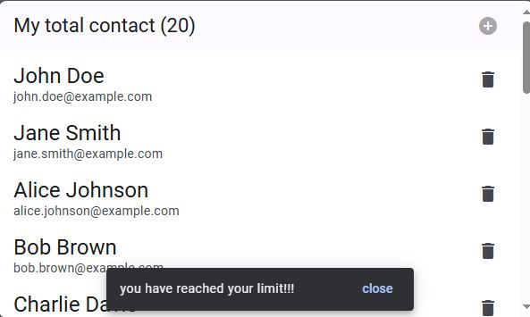
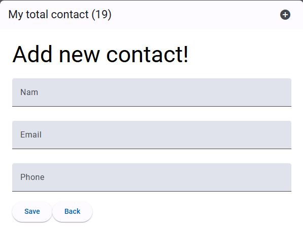

# Angular Signals Contacts

This project was generated with [Angular CLI](https://github.com/angular/angular-cli) version 18.0.4.
This project is a simple Angular application that allows users to manage contacts using Angular signals and Angular Material components. Users can add contacts, display them as a list, and delete contacts as needed.
## Features

- **Add Contact**:
  - Users can add new contacts using a form.
  - Contact details include name, email, and phone number.
  
- **List Contacts**:
  - Displays a list of all existing contacts.
  - Each contact is displayed with their name, email, and a delete button.
  
- **Delete Contact**:
  - Users can delete contacts from the list using the delete button associated with each contact.

- **Angular Signals**:
  - Utilizes Angular signals (`signal` and `computed`) for managing reactive state (contacts list and computed properties).
  
- **Angular Material Components**:
  - Uses Angular Material components for the user interface.
  - Components include `MatToolbar`, `MatIconModule`, `MatButtonModule`, `MatList`, `MatFormField`, `MatInput`, `MatSnackBar`, etc.
  
- **Routing**:
  - Uses Angular Router for navigation between components.
  - Routes include:
    - Default route (`/`): Displays the list of contacts (`ContactsListComponent`).
    - `/add` route: Displays the form to add a new contact (`AddContactComponent`).
    


## Screenshots

  

### Contact List Page

The contact list page displays all contacts.

  



  

### Add Contact Page

In the add contact page user can add new contact

  




  
## Technologies Used

  

- Angular

- Angular Material

- Angular Signals


## Components

### ContactsListComponent

- Displays a list of contacts.
- Each contact item includes their name, email, and a delete button.

### AddContactComponent

- Provides a form to add a new contact.
- Includes fields for entering contact details (name, email, phone).

### AppComponent

- Main component that provides the application layout.
- Displays a toolbar with the total number of contacts and an "Add Contact" button.
- Includes a notification using `MatSnackBar` when the maximum contact limit is reached.

## Setup Instructions

To run the Angular Signals Contacts App locally on your machine, follow these steps:


1. **Clone the repository**:

```bash

git clone https://github.com/yarob-alrifai/angular-signals-contacts.git

   cd angular-signals-contacts

```

  

2. **Install dependencies**:

```bash

npm install

```

  

3. **Generate dummy data**:

```bash

npm run generate

```

  

4. **Start the JSON Server backend**:

```bash

npm run server

```

  

5. **Start the Angular frontend**:

```bash

npm start

```

  

6. **Open your browser and navigate to** `http://localhost:4200`

  


## License

  

This project is licensed under the MIT License - see the [LICENSE](LICENSE) file for details.

  

## Contributing

  

We welcome contributions from the community. Please see the [CONTRIBUTING](CONTRIBUTING.md) file for more details.
